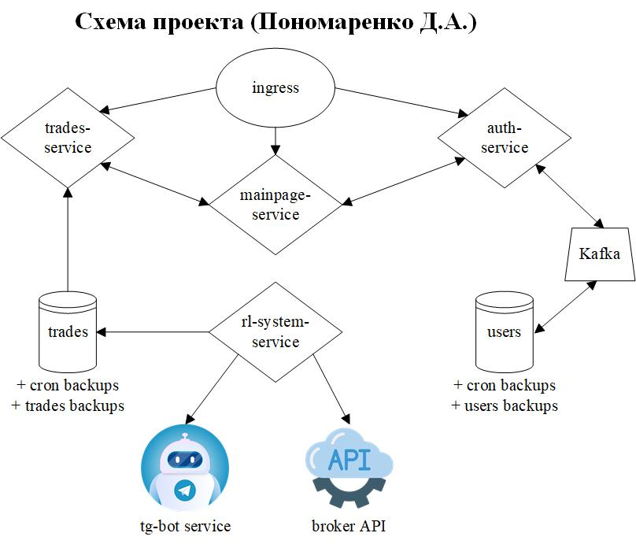

# Проект: "Системы хранения и обработки данных"

## Основная информация и структура проекта

Архив содержит yaml-манифесты с описанием элементов для развертывания в Kubernetes предполагаемых компонент микросервисного приложения для автоматической торговли на бирже и отображения результатов с помощью веб-приложения.

**Систему можно поделить на три составляющих части:**
1) Торговая система (rl-system сервис);
2) Микросервисы для веб-приложения (trades, mainpage, auth сервисы, базы данных для этих сервисов и очередь сообщений для сервиса авторизации):  
    
    - Mainpage service: один из сервисов для веб-приложения, используется для отображения главной страницы (справочная информация/ссылки на сторонние ресурсы) и вспомогательных для неё, не требует авторизации для просмотра;
    - Trades service: позволяет просматривать последние сделки торговой системы, скачивать архив сделок за определенный промежуток времени (например неделю / месяц), используется кэширование запросов для уменьшения кол-ва запросов к БД, требует авторизации для просмотра;
    - Auth service: сервис авторизации.
3) Telegram бот для автоматической отсылки отчетности владельцу в тг.

**Система содержит:**
- внешние зависимости:
    1) API брокера (Sber/T-Bank/VTB или др.)
    2) Telegram API для отсылки сообщений в телеграм
- базы данных:
    1) База данных пользователей
    2) База данных совершенных сделок
- хранилища данных:
    1) Для бэкапов БД пользователей
    2) Для бэкапов БД сделок
- брокер сообщений:
    1) Kafka для сервиса авторизации для исключения ситуаций с дублированием пользователей при регистрации (злоумышленник может отправить два запроса на регистрацию в крайне короткий промежуток времени и сломать всю систему)

    

 

## Описание yaml-манифестов
- **Auth service**:
    - auth-service.yaml - содержит service, deployment и network policy для данного сервиса;
    - cron-users-db-backup.yaml - содержит cronjob для ежедневного бэкапа БД пользователей;
    - users-db-backup.yaml - содержит job для бэкапа БД пользователей (напр. чтобы сделать бэкап перед выкаткой новой версии приложения);
    - users-db-configmap.yaml - содержит configmap с данными для подключения к БД с правами только на чтение, данными для подключения к брокеру сообщений;
    - users-db-secrets.yaml - содержит secret с данными для подключения к БД с правами на запись.
- **Mainpage service**:
    - mainpage-service.yaml - содержит service, deployment и network policy для данного сервиса.
- **Trades service**:
    - trades-service.yaml - содержит service, deployment и network policy для данного сервиса;
    - cron-trades-db-backup.yaml - содержит cronjob для ежедневного бэкапа БД сделок;
    - trades-db-backup.yaml - содержит job для бэкапа БД сделок (напр. чтобы сделать бэкап перед выкаткой новой версии приложения);
    - trades-db-configmap.yaml - содержит configmap с данными для подключения к БД с правами только на чтение;
    - trades-db-secrets.yaml - содержит secret с данными для подключения к БД с правами на запись.
- **RL-system service**:
    - rl-system.yaml - содержит service, deployment и network policy для данного сервиса.
- **Telegram-bot service**:
    - tg-bot.yaml - содержит service, deployment и network policy для данного сервиса;
    - tg-bot-secrets.yaml - содержит secret с данными для подключения tg бота.
- **Корневая папка**:
    - default-deny-all.yaml - network policy для запрета любых подключений между сервисами;
    - ingress-controller.yaml - ingress для маршрутизации трафика;
    - prod_ns.yaml = манифест для namespace данной системы.

## Требования для серверов
Данная система рассчитана на небольшой трафик и поэтому я бы выбрал два сервера: 128Гб ОЗУ, 1Тб HDD, 512Гб nvme m2 SSD, 32 ядра CPU (в двух экземплярах) для поддержания максимальной стабильности (можно продублировать сервисы на две ноды и сделать переход трафика на другую ноду в случае физического отказа одной).

